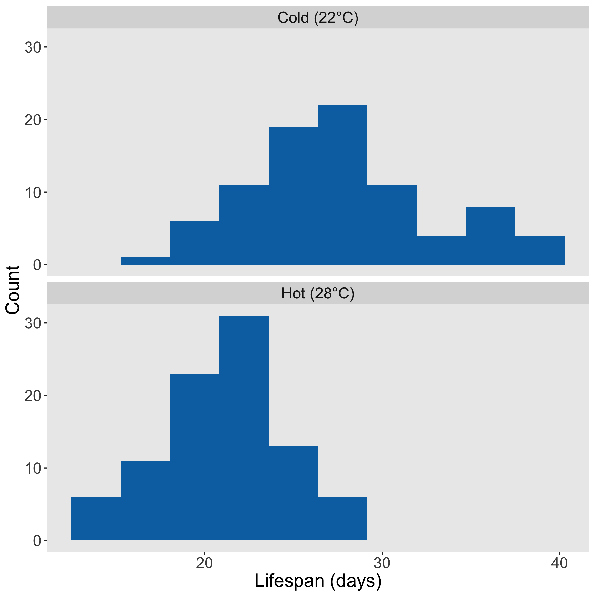
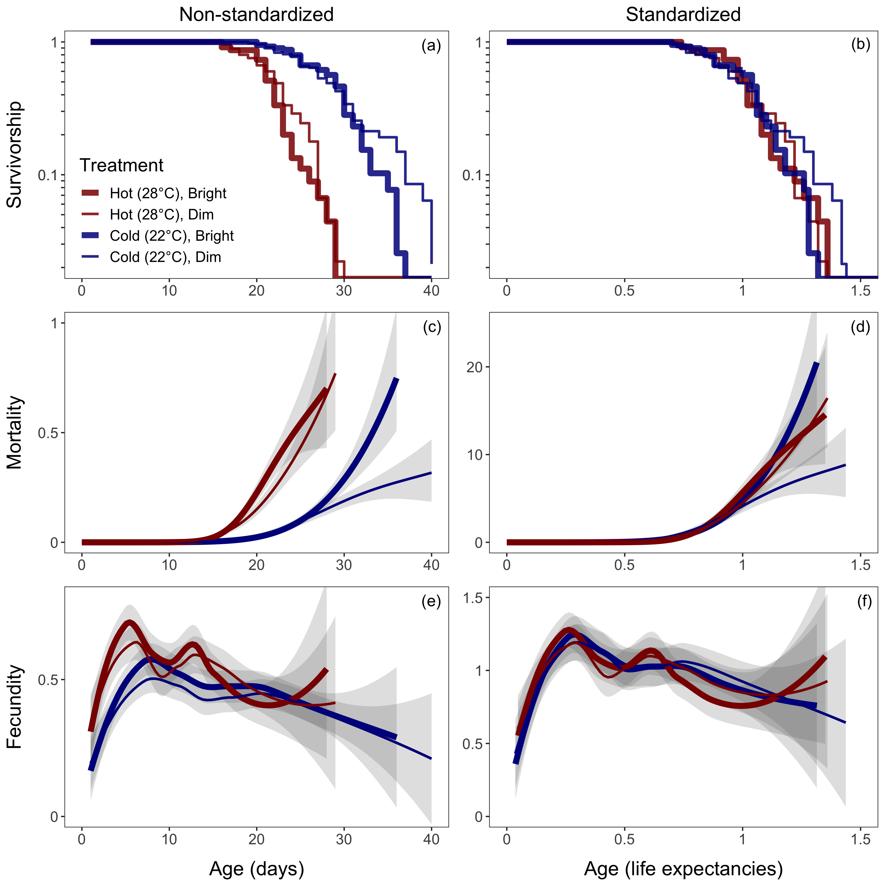

temp-light
==========

Data and R code from an experiment on the pace and shape of senescence in _Lemna minor_ as a function of temperature and light intensity.

&nbsp;
&nbsp;

#### **Fig. 1.** Lifespan as a function of temperature treatment

&nbsp;

#### **Fig. 2.** Trajectories of survivorship, mortality, and fecundity by treatment
